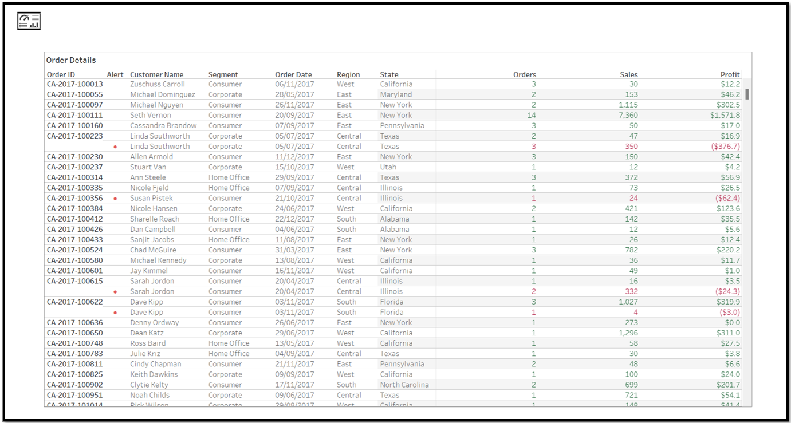
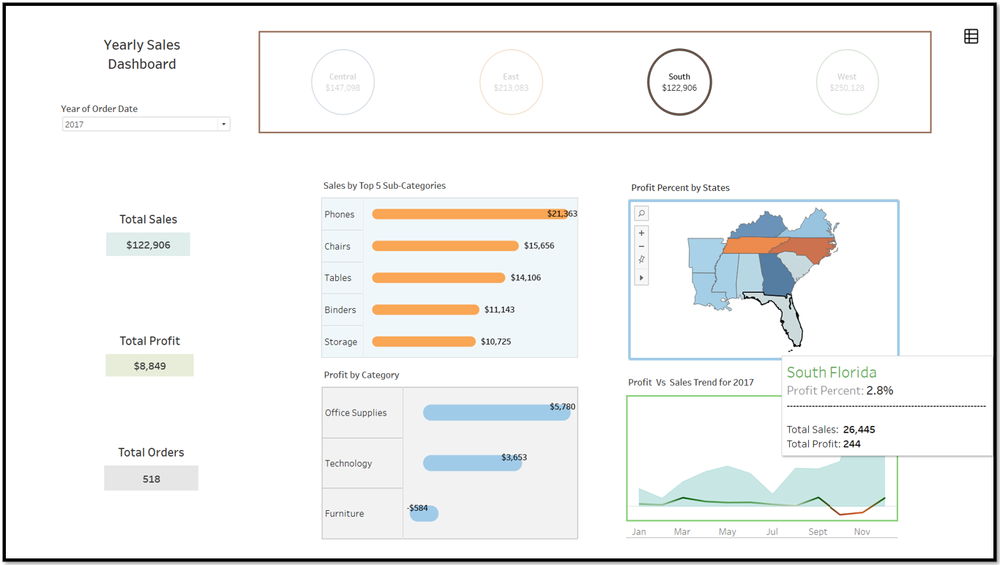
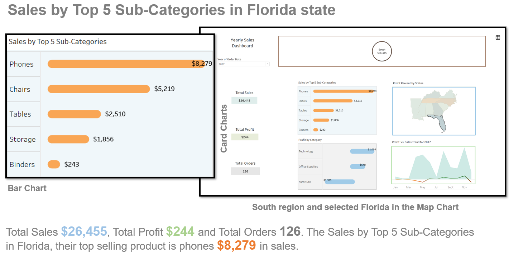
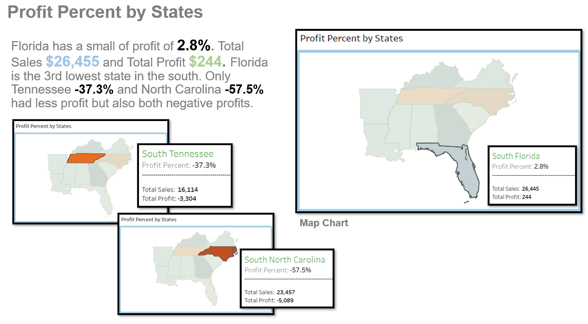
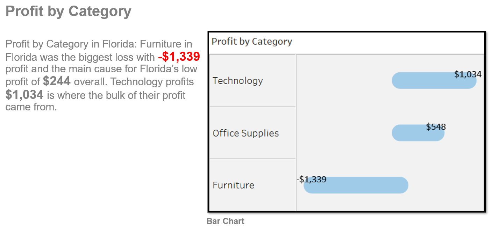
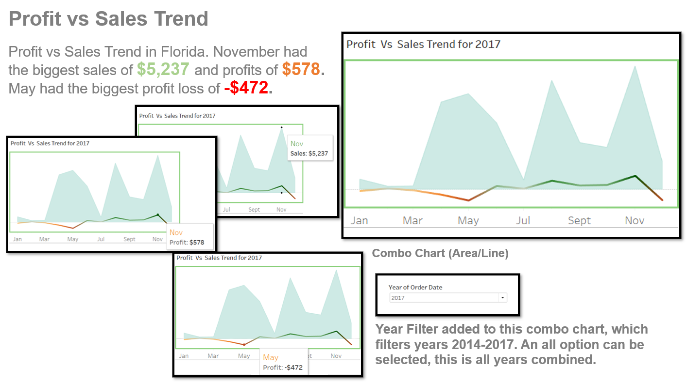
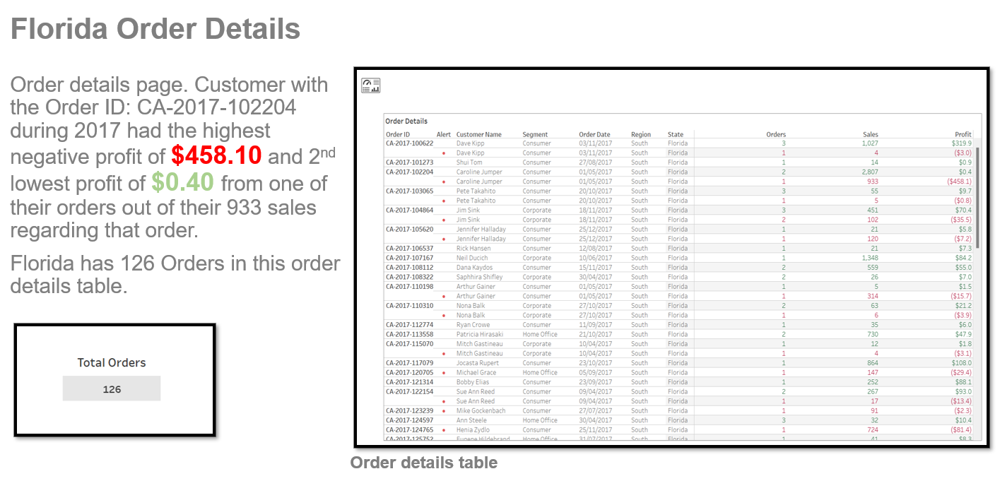

# YearlySalesDashboard
## US Superstore   
### Tableau dynamic dashboard 

  

### US Superstore data of US 2014-2017 sales and profits, using Tableau for the visualization.

### In this report the focus will on the US Superstore 2017 data of US sales and profits only from their stores in the state of Florida. 

### I will analyze: 

<li>Sales by Top 5 Sub-Categories in Florida state.  
<li>Profit Percent by States. 
<li>Profit by Category.
<li>Profit vs Sales Trend. 

### Software Used: 
Tableau 

Charts used: Bar Chart x2, Map Chart, Combo Chart (Area/Line) 
and Card Chart x3. 

South Region Dashboard Totals  
  
 
 
 
 
 
 
 
 
 
 
 
 
 
 

## Gif of how the Dashboard works and at the bottom is a live link to the dashboard
 

## Summary 

### In this report I analysed: 

<li>Sales by Top 5 Sub-Categories in Florida state.  
<li>Profit Percent by States. 
<li>Profit by Category.
<li>Profit vs Sales Trend. 

### Total Sales $26,455, Total Profit $244 and Total Orders 126. The Sales by Top 5 Sub-Categories in Florida their top selling product is phones $8,279. Florida has a small of profit of 2.8% the lowest profit in the south year of 2017. The Furniture category in Florida was the biggest loss with -$1,339 profit. Profit vs Sales Trend in Florida, November had the biggest sales of $5,237 and profits of $578. 
### Order details, customer with the Order ID: CA-2017-102204 during 2017 had the highest negative profit of $458.10 and 2nd lowest profit of $0.40 from one of their orders out of their 933 sales regarding that order. 
### Florida has to work on improving their furniture sales because this is where the most loss is from. My suggestions is to make more unique furniture to suit many types of customers. Also design new styles of furniture that takes inspiration from the sunny weather of the this state because Florida is one of the most unique states in the US.

[Live Link](https://public.tableau.com/views/YearlySalesDashboard_16656310983210/SalesDashboard_Page?:language=en-GB&publish=yes&:display_count=n&:origin=viz_share_link)
