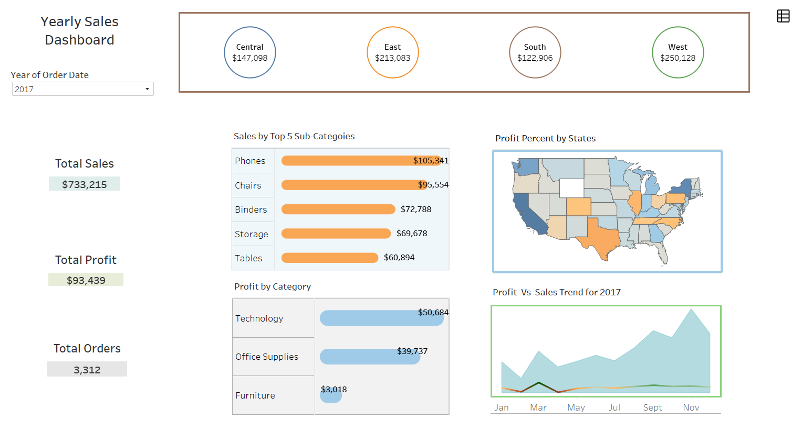
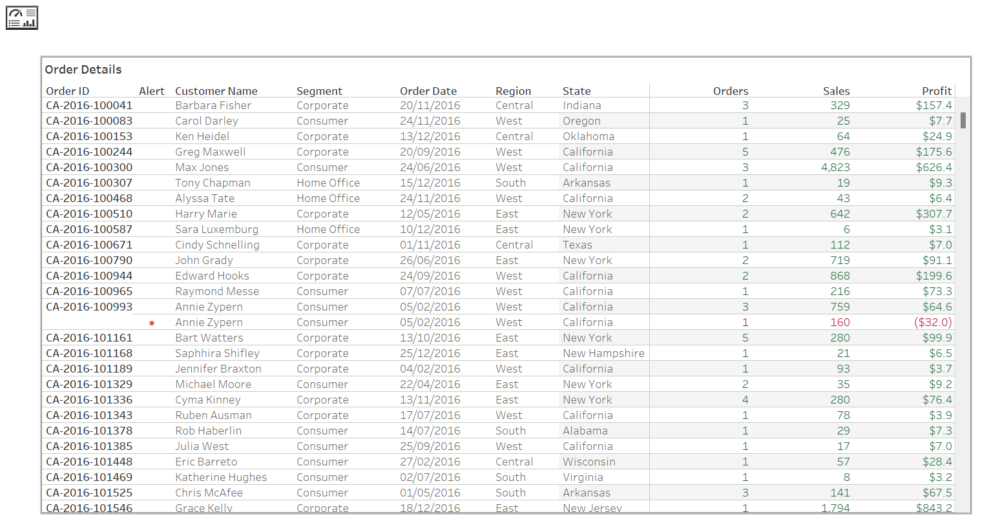

# YearlySalesDashboard
## US Superstore   
### Tableau dynamic dashboard 

<li>The Excel dataset used is called Sample Superstore. 
<li>Tableau was used for this dashboard. 
<li>Charts used: 2x bar charts, area/line chart, map. 

The dashboard three sections to the left total sales, total profit and total orders.

## Gif images below to show how the dashboard works and a live link at the bottom. 

The dashboard is dynamic by selecting any of the region up top you can directly drill into that particular region. If I select south region all my visual well transform to that region. You can only see the states for that region. Also, if you go to order details it displays that region’s information. If I drill further my states to Georgia are my visuals will match to that chosen state these are the ways my dashboard is interactive and dynamic. If I go to the order details it will show that selected region and state. 

 

The Profit vs Sales Trend chart is a marge of the line(profits) and area(sales) charts. Also you can see details of the profit by category and sales by top 5 sub-category on the bar charts. Order details numbers in red is minus profit, this is formatted to only two colours and the red is in the direction of negative for no profits. The red dot between the order id and customer names, this is an alert of customers that have lost profits year of 2014.
 

 

A user can select two regions at a time and see the details and then select one state from either region year chosen 2015.
 

 

A user can aslo select three regions at a time and see the details and then select one state from any of those regions year chosen 2016.
 

 

To select east and west regions only or any two regions click ctrl + shift hold these buttons on your keyboard and select each region. The order details shows these two regions or any regions you select. 

[Live Link](https://public.tableau.com/views/YearlySalesDashboard_16656310983210/SalesDashboard_Page?:language=en-GB&publish=yes&:display_count=n&:origin=viz_share_link)
